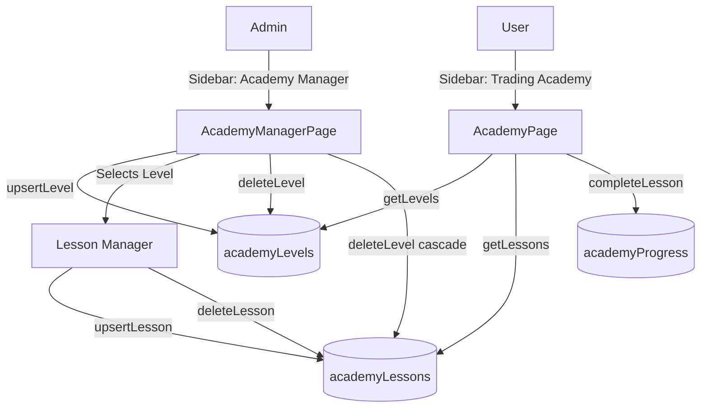

# Trading Academy CRUD Architecture

## 1. User Roles (`convex/schema.ts`)

The `users` table is **inlined** from `authTables` and extended with a typed `role` field:

```ts
role: v.optional(v.union(v.literal("admin"), v.literal("member")))
```

- `"admin"` — Full CRUD access to Academy Manager, Trade Monitor, Members.
- `"member"` — Default. Read-only academy content + personal trading.
- `undefined` — Treated as `"member"`.

The primary admin email (`admin@luxurious.trade`) always has admin access regardless of the `role` field.

## 2. Database Schema

| Table | Purpose |
|---|---|
| `academyLevels` | Modules (e.g., "Market Foundations") |
| `academyLessons` | Content blocks inside levels (linked via `levelId`) |
| `academyProgress` | Tracks user completion per lesson slug |

## 3. API Mutations (`convex/academy.ts`)

### Levels
| Mutation | Action |
|---|---|
| `upsertLevel` | Create or update a level (`order`, `title`, `subtitle`, `color`, `description`) |
| `deleteLevel` | Remove level + **cascade delete** all lessons |

### Lessons
| Mutation | Action |
|---|---|
| `upsertLesson` | Create or update a lesson (`levelId`, `order`, `slug`, `title`, `duration`, `content`) |
| `deleteLesson` | Remove a single lesson |

### User Progress
| Mutation | Action |
|---|---|
| `completeLesson` | Mark a lesson as completed (idempotent via `by_user_and_slug` index) |

## 4. Admin UI

Navigate to **Administration → Academy Manager** (`/admin/academy`) in the sidebar:

- **Level List** — View all modules, hover to reveal edit/delete buttons.
- **Level Editor** — Modify module metadata (title, subtitle, color).
- **Lesson Manager** — Add, edit, or remove lessons within a level.
- **Markdown Preview** — Toggle between edit and preview modes for lesson content.

## 5. Initial Seeding (`convex/init.ts`)

Run `npx convex run init:run` to populate the database with 4 pre-built levels (20 lessons total). Uses `internal.academy.seedLevel` which is idempotent — safe to run multiple times.

## 6. Flow Diagram



## 7. Dev Tips

- **Slugs**: Use `{levelOrder}.{lessonOrder}` format (e.g., `1.1`, `2.3`) for reliable progress tracking.
- **Colors**: Use HSL format (e.g., `hsl(221 83% 53%)`) for design system compatibility.
- **Cascade**: Deleting a level permanently removes all its lessons. Always confirm.
- **Roles**: Set via Members page (`/members`) — click the shield icon to toggle admin/member.
- **Testing**: See [TEST-CREDENTIALS.md](./TEST-CREDENTIALS.md) for pre-built login accounts.
